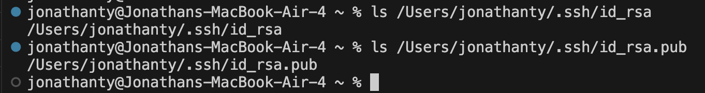
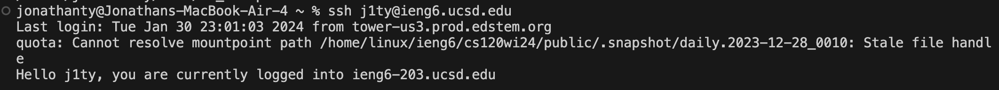

# __Lab Report 2__

***
## Code Block
```
import java.io.IOException;
import java.net.URI;
import java.util.ArrayList;

class Handler implements URLHandler {
    ArrayList<String> chatLog = new ArrayList<>();
    public String handleRequest(URI url) {
        if (url.getPath().equals("/")) {
            if (chatLog.isEmpty()) {
                return "/add-message?s=<String>&user=<String>";
            }
            return String.join("\n", chatLog);
        } else if (url.getPath().equals("/add-message")) {
            String[] parameterStrings = url.getQuery().split("&");
            String message = parameterStrings[0].substring(parameterStrings[0].indexOf("=") + 1);
            String username = parameterStrings[1].substring(parameterStrings[0].indexOf("user=") + 6);
            String newMessage = String.format("%s: %s", username, message);
            chatLog.add(newMessage);
            return String.join("\n", chatLog);
        } else {
            return "404 Not Found!";
        }
    }
}
```
***

## /add-message Request #1


The path of this incoming request is ``/add-message`` and following with a query "?s=Hello, world!&user=JonathanTy"

## /add-message Request #1 Page Result


The result is a new line of ``String`` with its content being "JonathanTy: Hello,+world!"

__The class fields are called__
- ``chatLog``

The field is an ``ArrayList<String>`` object that instantiates a new ``ArrayList<String>`` object everytime the class is run. This field is meant to store ``newMessage`` containing a valid user and message from the query.

__The methods in my code that are called are__
- ``handleRequest(URI url)``

The argument ``URI`` ``url`` is the url created through the Server.java file on the ChatServer.java file. The method ``handleRequest()`` passes a new url argument everytime a request is made on the web server. The method is meant to handle incoming requests by the user. First checking to see if path meets conditions to perform one of four results: return the format of a valid chat message, return an existing ``chatLog``, return return an updated ``chatLog`` with a valid ``newMessage``, or return a "404 Not Found!" ``String``. This method directly dictates the ``size`` of the ``ArrayList<String>`` ``chatLog`` whether it adds a new ``String`` object ``newMessage`` into ``chatLog`` or not.

There are no relevent arguments. Relevant values is the whatever follows the key "?" in a Path. The values changes from this specific request based on whatever the user inputs into the Query and is variable. If no changes were made to following the method call, it is based on the user's choice.

- ``getQuery():``

There are no relevent arguments. Relevant values is the whatever follows the key "?" in a Path. The values changes from this specific request based on whatever the user inputs into the Query and is variable. If no changes were made to following the method call, it is based on the user's choice.

- ``split(String regex)``

The argument ``String`` ``regex`` splits the ``String`` the method is called on by the given regular expression, or ``regex``. Relevant values is the split ``String`` elements created in the ``String`` array. The values changes because the split elements may have differing ``String`` lengths because a portion of the element is determined by what the user inputs. If no changes were made to following the method call, it is based on the user's choice of keeping whatever followed the previous query. 

- ``substring(int beginIndex)``

The argument ``int`` ``beginIndex`` is used on to create a substring of a given ``String`` beginning at an passed index. Relevent values is the ``length`` of the split query because depending on user input, the ``length`` and content of the ``String`` may differ. If no changes were made to following the method call, it is based on the user's choice of keeping whatever followed the previous query. 

- ``indexOf(String str)``

The argument ``String`` ``str`` returns an index value of a given ``String`` based on where the first occurence of the passed ``str`` occur in the ``String`` object. Relevant values is "="/"user=", +1, and +6. This is because the index starts at the first occurence but we do not want to include "=" into the substring, only what follows the "=", so +1 and +6 shifts the start index of substring creation. The values are not intended to change and if it were, it would because invalid user input.  

- ``format(String format, Object... args)``

The argument ``String`` ``format`` and ``Object``... ``args`` plugs in the provided ``args`` into the positions were formatting is called in the ``String``, with the key for formatting being "%". The username and message that was split and substring'd is used as formatting into the ``String`` format. The format ``String`` remains constant while username and message is variable based on user input.

- ``add(E e)``

The argument E e adds an generic matching the declared type of an ``ArrayList`` into the ``ArrayList``. The relevant values is the newMessage passed. Based on the user input into the request, the newMessage that follows "(user): (message)" formatting is highly variable. These values will not change if user does another request the same user and message. This method directly affects the ``size`` of the ``ArrayList<String>`` ``chatLog`` with its addition of a new ``String`` object ``newMessage`` into ``chatLog``.

- ``join(CharSequence delimiter, CharSequence... elements)``

The argument ``CharSequence`` ``delimiter``, ``CharSequence`` elements is used to insert delimiter between each element of the ``ArrayList`` chatLog, which in this case is "\n". The relevant values is "\n" and chatLog because it'll return a new line for each chat message stored into the chatLog ``ArrayList``. The fields ``chatLog`` is expected to change and be updated for each insertion of a new chat message.


***

## /add-message Request #2


The path of this incoming request is ``/add-message`` and following with a query "?s=Hello!&user=World"

## /add-message Request #2 Page Result


The result is a two lines of ``String`` containing the inital request chat message in the first line and the second line with its content being "World: Hello!"

__The methods in my code that are called are__
- ``getQuery()``

There are no relevent arguments. Relevant values is the whatever follows the key "?" in a Path. The values changes from this specific request based on whatever the user inputs into the Query and is variable. If no changes were made to following the method call, it is based on the user's choice.

- ``split(String regex)``

The argument String regex splits the String the method is called on by the given regular expression. Relevant values is the split String elements created in the String array. The values changes because the split elements may have differing String lengths because a portion of the element is determined by what the user inputs. If no changes were made to following the method call, it is based on the user's choice of keeping whatever followed the previous query. 

- ``substring(int beginIndex)``

The argument int beginIndex is used on to create a substring of a given string beginning at an passed index. Relevent values is the length of the split query because depending on user input, the length and content of the String may differ. If no changes were made to following the method call, it is based on the user's choice of keeping whatever followed the previous query. 

- ``indexOf(String str)``

The argument String str returns an index value of a given String based on where the first occurence of the passed str occur in the String object. Relevant values is "="/"user=", +1, and +6. This is because the index starts at the first occurence but we do not want to include "=" into the substring, only what follows the "=", so +1 and +6 shifts the start index of substring creation. The values are not intended to change and if it were, it would because invalid user input.  

- ``format(String format, Object... args)``

The argument String format and Object... args plugs in the provided args into the positions were formatting is called in the String, with the key for formatting being "%". The username and message that was split and substring'd is used as formatting into the String format. The format String remains constant while username and message is variable based on user input.

- ``add(E e)``

The argument E e adds an generic matching the declared type of an ArrayList into the ArrayList. The relevant values is the newMessage passed. Based on the user input into the request, the newMessage that follows "(user): (message)" formatting is highly variable. These values will not change if user does another request the same user and message. 

- ``join(CharSequence delimiter, CharSequence... elements)``

The argument CharSequence delimiter, CharSequence elements is used to insert delimiter between each element of the ArrayList chatLog, which in this case is "\n". The relevant values is "\n" and chatLog because it'll return a new line for each chat message stored into the chatLog ArrayList. The fields chatLog is expected to change and be updated for each insertion of a new chat message.


***
## Absolute Path to _private_ and _public_ key for your SSH key for logging into ieng6



## A terminal interaction where I log into my ieng6 account without being asked for a password.



***
# Reflection

Something I didn't know before that I learned during Week 2 and 3 was the existence of SSH Keys, it allows for automated sign on by authenticated users. Through this process, the user saves plenty of time typing the appropriate terminal commands and manually providing their password. Additionally, I learned about queries and how it can added to a path and allow for user input to used as arguments for website programming. 
