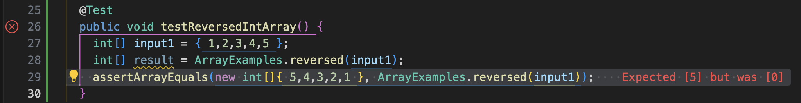

# __Lab Report 3__

***
## Part 1 - Bugs

Provide:

A failure-inducing input for the buggy program, as a JUnit test and any associated code (write it as a code block in Markdown)
An input that doesn't induce a failure, as a JUnit test and any associated code (write it as a code block in Markdown)
The symptom, as the output of running the tests (provide it as a screenshot of running JUnit with at least the two inputs above)
The bug, as the before-and-after code change required to fix it (as two code blocks in Markdown)
Briefly describe why the fix addresses the issue.

The buggy program I chose was the ``reversed(int[] arr)`` method.

For reference, here is the original code for this buggy program:
``
  static int[] reversed(int[] arr) {
    int[] newArray = new int[arr.length];
    for(int i = 0; i < arr.length; i += 1) {
      arr[i] = newArray[arr.length - i - 1];
    }
    return arr;
  }
``

Here is a JUnit test with an input which __would__ induce a failure:
``
@Test 
	public void testReversedIntArray() {
    int[] input1 = { 1,2,3,4,5 };
    int[] result = ArrayExamples.reversed(input1);
    assertArrayEquals(new int[]{ 5,4,3,2,1 }, ArrayExamples.reversed(input1));
	}
``
The input in this case was an ``int`` array of non-decreasing order with 5 elements. The method didn't return an ``int`` array with its elements reversed in position.

Here is a JUnit test with an input which __would NOT__ induce a failure:
``
@Test
  public void testReversedEmptyArray() {
    int[] input1 = { };
    assertArrayEquals(new int[]{ }, ArrayExamples.reversed(input1));
  }
``
The input in this case was an ``int`` array containing no elements. The method correctly returned an ``int`` array which in this case was empty.

Here is the symptom, or the output of running the two tests:

In this section, the before-and-after code change required to fix the buggy program will be provided:

Original code
``
  static int[] reversed(int[] arr) {
    int[] newArray = new int[arr.length];
    for(int i = 0; i < arr.length; i += 1) {
      arr[i] = newArray[arr.length - i - 1];
    }
    return arr;
  }
``

Changed code
``
  static int[] reversed(int[] arr) {
    int[] newArray = new int[arr.length];
    for(int i = 0; i < arr.length; i += 1) {
      newArray[i] = arr[arr.length - i - 1];
    }
    return newArray;
  }
``

The proposed fixes addresses the issues with the program because it follows the intention of the program which is to "returns a *new* array with all the elements of the input array in reversed." The original code returns the ``int[] arr`` passed as an argument instead of the ``int[] newArray`` instantiated in the method; the changed code correctly returns a new array. Additionally, the code inside the for-loop fails to assign the correct elements to the correct array, assigning at each index of ``arr`` the element found in ``newArray`` in its reversed index order, which is 0 since it is newly instantiated ``int[]`` array with no assignment whatsoever at any of its indices.

