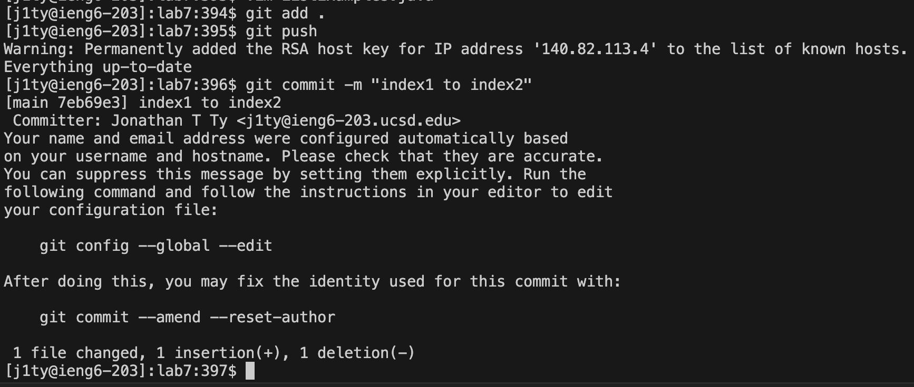

# Lab Report 4
___

## Step 4. Log into ieng6
* The keys that were pressed were 
> s s h `<space>` j 1 t y @ i e n 6 . u c s d . e d u `<enter>`

The command that I ran `ssh` was intended for me, the user, to remotely access and manage the system of a remote computer. The effects of the those key presses were intended to call the `ssh` command and afterwards providing the username and hostname of the remote system you want to connect to, or `user@host-name`. There is no such preexisting call of the command in the bash history so my bash history was not used for this step.

___

## Step 5. Clone your fork of the repository from your Github account (using the SSH URL)
* The keys that were pressed were
> g i t `<space>` c l o n e `<space>` `<Control-V>` `<enter>`

The command that I ran `git clone` was intended for me to create a fork of the repository from my Github account. The effects of the these key presses were to call the git clone command and then afterwards paste the SSH link that I copied from Github. Utilizing copying and pasting is an extremely convenient tool that is intended to speed up the process rather than typing it word-for-word, letter-by-letter. As opposed to constantly referring back to Github to find out what characters are used for the SSH link, I can simply copy and paste the link unto the terminal. 

___

## Step 6. Run the tests, demonstrating that they fail
* The keys that were pressed were
> c d `<space>` l <tab>, b a s h `<space>` t `<tab>` `<enter>`

The command that I ran `cd` was intended for me to change the directory to a folder containing a shell script that compiles and runs the test file `bash.sh` located in the lab7 directory. The effects of the these key presses were meant to write down the command letter-by-letter and afterwards performing auto-completion with `<tab>`. `<tab>` is a shortcut to provide the directory and file name if given the first few unique characters, searching through to find matches of directories/files with that name. This is definitely quicker than having to type out the whole directory/file name.

___

## Step 7. Edit the code file to fix the failing test
* The keys that were pressed were
> v i m `<space>` L `<tab>` . j `<tab>`, 4 4 G -> 1 2 | -> s 2 `<esc>`, : w q

The command that I ran `vim` enables text editting on a given file name. As aforementioned by Step 6, I used the auto-complete shortcut of the `<tab>` key to access the `ListExamples.java` file. Afterwards, in the text editer `vim`, I need to change the variable that is being incremented from `index1` to `index2.` The 1 in the variable name can be quickly accessed by the `G` key navigation tool, which can take you to a specified row in the text (Row 44); additionally, the column where 1 is located can accessed through the `|`, which can take you a specified column in the text. Once you are at the position where edits must be made, `s` removes the initial character where the cursor was and then enters insert mode. Simply insert 2 into the text. `<esc>` will exit out of insert mode. From there, `:wq` will save and quit vim.

___

## Step 8. Run the tests, demonstrating that they now succeed
* The keys that were pressed were
> `<up>` `<up>` `<enter>`

When I want to rerun the tests that we did in Step 6, I'd use the up arrow to access my bash history rather than typing in the full command with classpath. And so, my second most recent command I've made in the terminal was when I called the `bash test.sh` command. By pressing `<up>` two times this command appeqrs in the terminal where I execute it with `<enter>`. 

___

## Step 9. Commit and push the resulting change to your Github account (you can pick any commit message!)
* The keys that were pressed were
> g i t `<space>` a d d `<space>` . , g i t `<space>` c o m m i t `<space>` - m `<space>` "index1 to index2"

The command `git add .` is intended to include the ALL changes that I've made in the repository into the staging area to be included in the next commit, including the changes made to `ListExamples.java` through the `vim` text editor. Afterwards, I used the command `git commit -m ""` in order to record the changes staged as a new commit in the Git history. The command line option `-m` is so that it attaches a message with the commit you've made, normally this message should indicate what were the changes made to the repository. So befittingly, my commit message was "index1 to index2" since that was the sole change I made to `ListExamples.java`.

